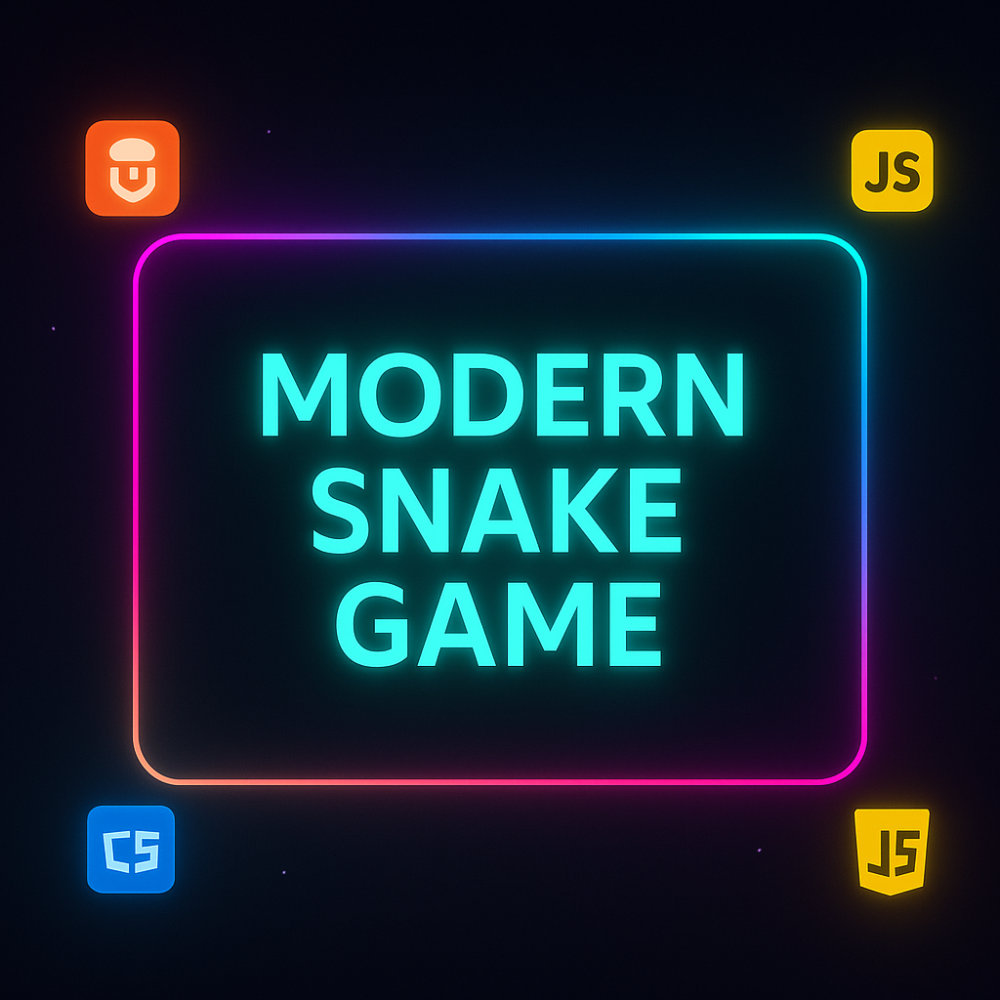
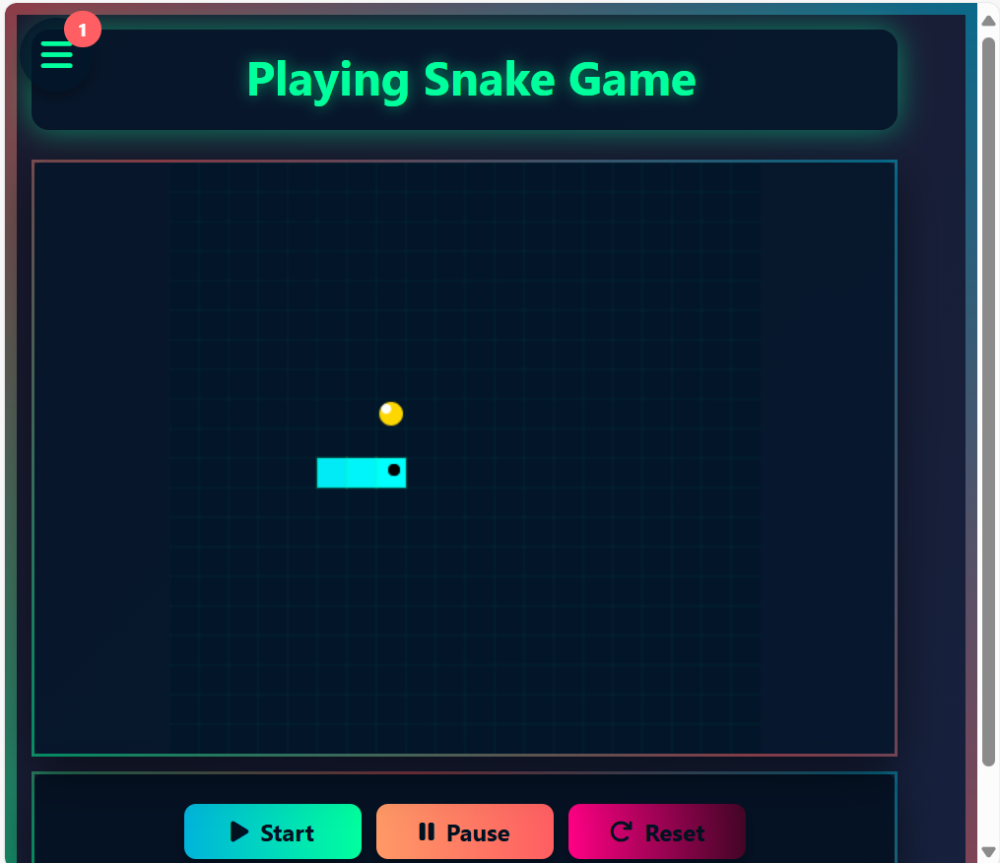
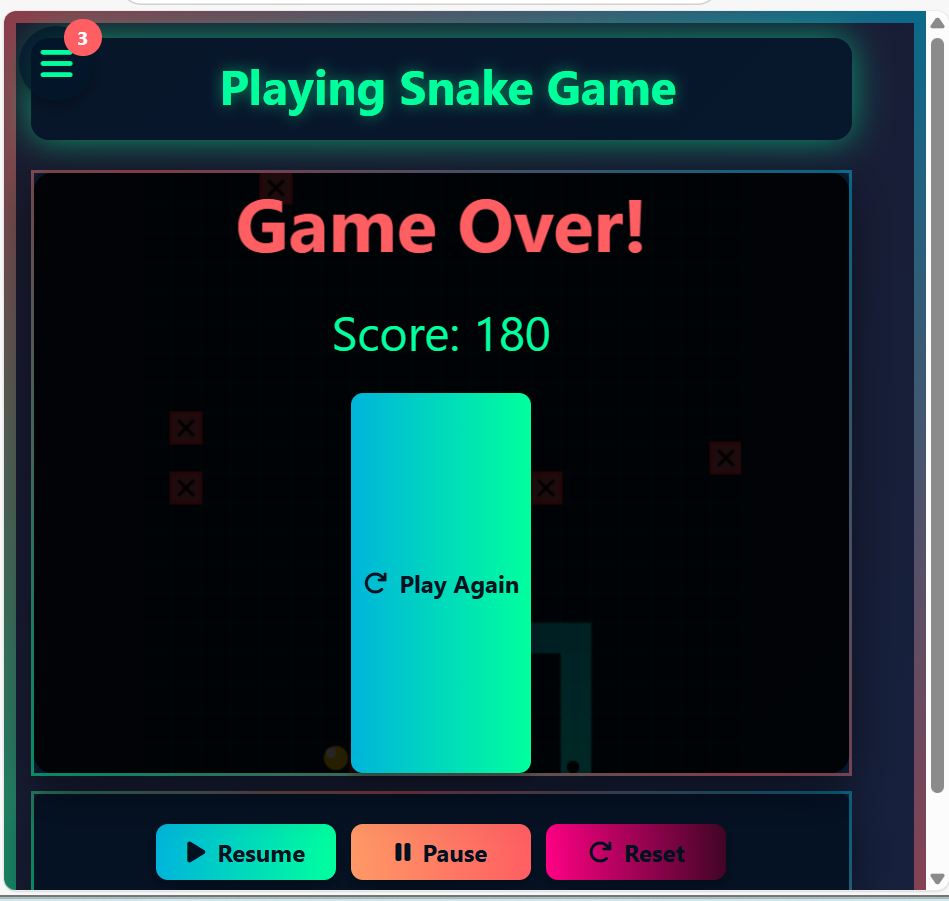

<<<<<<< HEAD
=======
<p align="center">
  
</p>
# 🐍 Snake Game

A classic snake game built with **HTML, CSS, and JavaScript**. Eat, grow, and try to beat your high score! This project demonstrates fundamental game logic, keyboard control handling, and DOM manipulation.
## 📚 Table of Contents

- [Demo](#demo)
- [Screenshots](#screenshots)
- [Features](#features)
- [Tech Stack](#tech-stack)
- [Installation](#installation)
- [File Structure](#file-structure)
- [Usage](#usage)
- [Contributing](#contributing)
- [License](#license)
## 🚀 Demo

Check out the live demo here: [Play Now](https://tekku-4.github.io/snake-game/)
## 🖼️ Screenshots

### ▶️ Start Screen


### 💀 Game Over

## ✨ Features

- Classic Snake gameplay
- Responsive design for desktop
- Keyboard arrow control
- Dynamic game-over and restart screen
- Score tracking and display
## 🔧 Tech Stack

- HTML5
- CSS3
- JavaScript (Vanilla JS)
## ⚙️ Installation

Clone the repository:

```bash
git clone https://github.com/teku-4/snake-game.git
cd snake-game

---

### 9. **File Structure**
```md
## 📁 File Structure

snake-game/
│
├── index.html
├── style.css
├── script.js
├── banner_image.png
├── image.png # Game Over screenshot
├── image1.png # Start screen screenshot
├── README.md
├── LICENSE
├── .gitignore
## 🕹️ Usage

- Use the arrow keys to move the snake.
- Eat the food to grow.
- Avoid colliding with the walls or yourself.
- Try to beat your highest score!
## 🤝 Contributing

Contributions are welcome! Please fork the repository and submit a pull request with improvements.

1. Fork the Project
2. Create your Feature Branch (`git checkout -b feature/AmazingFeature`)
3. Commit your Changes (`git commit -m 'Add some AmazingFeature'`)
4. Push to the Branch (`git push origin feature/AmazingFeature`)
5. Open a Pull Request
## 📝 License

MIT License

Copyright (c) 2025 ✨leta

Permission is hereby granted, free of charge, to any person obtaining a copy
of this software and associated documentation files (the "Software"), to deal
in the Software without restriction, including without limitation the rights
to use, copy, modify, merge, publish, distribute, sublicense, and/or sell
copies of the Software, and to permit persons to whom the Software is
furnished to do so, subject to the following conditions:

The above copyright notice and this permission notice shall be included in all
copies or substantial portions of the Software.

THE SOFTWARE IS PROVIDED "AS IS", WITHOUT WARRANTY OF ANY KIND, EXPRESS OR
IMPLIED, INCLUDING BUT NOT LIMITED TO THE WARRANTIES OF MERCHANTABILITY,
FITNESS FOR A PARTICULAR PURPOSE AND NONINFRINGEMENT. IN NO EVENT SHALL THE
AUTHORS OR COPYRIGHT HOLDERS BE LIABLE FOR ANY CLAIM, DAMAGES OR OTHER
LIABILITY, WHETHER IN AN ACTION OF CONTRACT, TORT OR OTHERWISE, ARISING FROM,
OUT OF OR IN CONNECTION WITH THE SOFTWARE OR THE USE OR OTHER DEALINGS IN THE
SOFTWARE.


